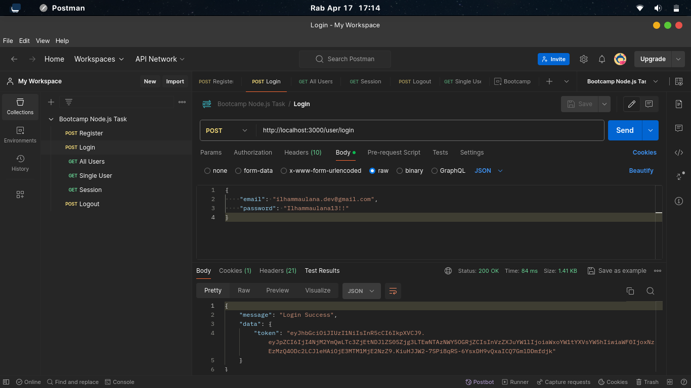
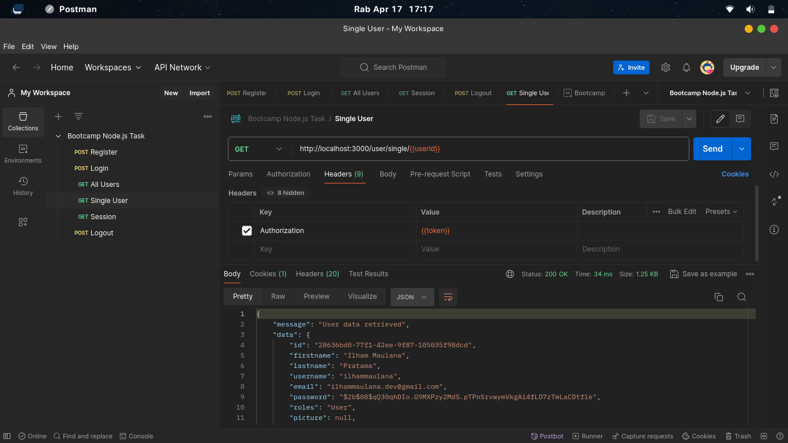

# Node.js Backend API CRUD User Management (Harisenin.com Bootcamp FSD Task)

Node.js Backend API CRUD User Management adalah backend servis yang digunakan untuk keperluan manajemen user dengan database MySQL.

Fitur:

- Create User
- Login & Logout
- Session Control
- Update User Information
- Delete User

## Hasil Test Menggunakan Postman

Jalankan test menggunakan Postman:

[](https://app.getpostman.com/run-collection/34320509-8008fd17-22c6-41f5-ba69-1d1ae12404f9?action=collection%2Ffork&source=rip_markdown&collection-url=entityId%3D34320509-8008fd17-22c6-41f5-ba69-1d1ae12404f9%26entityType%3Dcollection%26workspaceId%3De7c9d64e-33a4-46df-beaa-2c33ad184c3c#?env%5BEnvironment%5D=W3sia2V5IjoidG9rZW4iLCJ2YWx1ZSI6IjAiLCJlbmFibGVkIjp0cnVlLCJ0eXBlIjoiZGVmYXVsdCIsInNlc3Npb25WYWx1ZSI6ImV5SmhiR2NpT2lKSVV6STFOaUlzSW5SNWNDSTZJa3BYVkNKOS5leUpwWkNJNkltRXpZekZpTldKbExXRXdZemN0TkRnd1l5MDROall6TFRCak9EWXhZalV3WXpNNE1DSXNJblZ6WlhKdVlXMWxJam9pYVd4b1lXMXRZWFZzWVc1aElpd2lhV0YwLi4uIiwic2Vzc2lvbkluZGV4IjowfSx7ImtleSI6InVzZXJJZCIsInZhbHVlIjoiMCIsImVuYWJsZWQiOnRydWUsInR5cGUiOiJkZWZhdWx0Iiwic2Vzc2lvblZhbHVlIjoiYTNjMWI1YmUtYTBjNy00ODBjLTg2NjMtMGM4NjFiNTBjMzgwIiwic2Vzc2lvbkluZGV4IjoxfV0=)

### Register Test


Result on database with MySQL Workbench


### Login Test



Get Cookie


### Get All User Test


### Get Single User Test



### Update User Data Test


Result on database with MySQL Workbench


### Logout Test


Result: Cookie Deleted.


### Delete User Test


Result on database with MySQL Workbench


## Setup

1. Install aplikasi

```
npm install
```

2. Buat .env dan isi variable sesuai dengan namanya

```
cp .env.sample .env
```

3. Lakukan migrasi untuk pertama kali. Proses ini untuk membuat table pada database MySQL.

```
npm run migrate
```

4. Jalankan Aplikasi dalam mode development

```
npm run dev
```

## Lint

```
npm run lint
```

## Utilities

API Server utilities:

- [morgan](https://www.npmjs.com/package/morgan)
  - HTTP request logger middleware untuk node.js
- [helmet](https://www.npmjs.com/package/helmet)
  - Helmet meningkatkan keamanan Express apps dengan setting berbagai macam HTTP headers.
- [dotenv](https://www.npmjs.com/package/dotenv)
  - Dotenv merupakan zero-dependency module yang menyajikan environment variables dari `.env` file ke `process.env`
- [cors](https://www.npmjs.com/package/cors)
  - CORS adalah package node.js untuk menyediakan middleware Connect/Express yang dapat digunakan dalam mengaktifkan CORS dengan berbagai pilihan.

Development utilities:

- [typescript](https://www.npmjs.com/package/typescript)
  - Typescript adalah bahasa pemrograman berbasis JavaScript yang menambahkan fitur strong-typing.
- [ts-node](https://www.npmjs.com/package/ts-node)
  - Eksekusi TypeScript dan REPL untuk node.js, dengan peta sumber dan dukungan ESM asli.
- [nodemon](https://www.npmjs.com/package/nodemon)
  - nodemon adalah tool yang membantu mengembangkan aplikasi berbasis node.js dengan memulai ulang aplikasi node secara otomatis ketika perubahan file dalam direktori terdeteksi.
- [eslint](https://www.npmjs.com/package/eslint)
  - ESLint adalah alat untuk mengidentifikasi dan melaporkan pola yang ditemukan dalam kode ECMAScript/JavaScript.
- [typescript-eslint](https://typescript-eslint.io/)
  - Package yang memungkinkan ESLint mendukung TypeScript.
- [bcrypt](https://www.npmjs.com/package/bcrypt)
  - bcrypt adalah library Node.js untuk membantu hashing pasword (encrypt dan compare).
- [mysql2](https://www.npmjs.com/package/mysql2)
  - Klien MySQL untuk Node.js dengan fokus pada kinerja. Mendukung pernyataan yang disiapkan, pengkodean non-utf8, protokol log biner, kompresi, ssl, dan banyak lagi.
- [sequelize](https://www.npmjs.com/package/sequelize)
  - Sequelize adalah alat ORM Node.js yang mudah digunakan dan berbasis janji untuk Postgres, MySQL, MariaDB, SQLite, DB2, Microsoft SQL Server, dan Snowflake. Ini menampilkan dukungan transaksi yang solid, hubungan, pemuatan yang bersemangat dan lambat, replikasi baca, dan banyak lagi.
- [knex](https://www.npmjs.com/package/knex)
  - Knex dapat digunakan sebagai pembuat kueri SQL di Node.JS dan browser, terbatas pada batasan WebSQL (seperti ketidakmampuan untuk menghapus tabel atau membaca skema).
